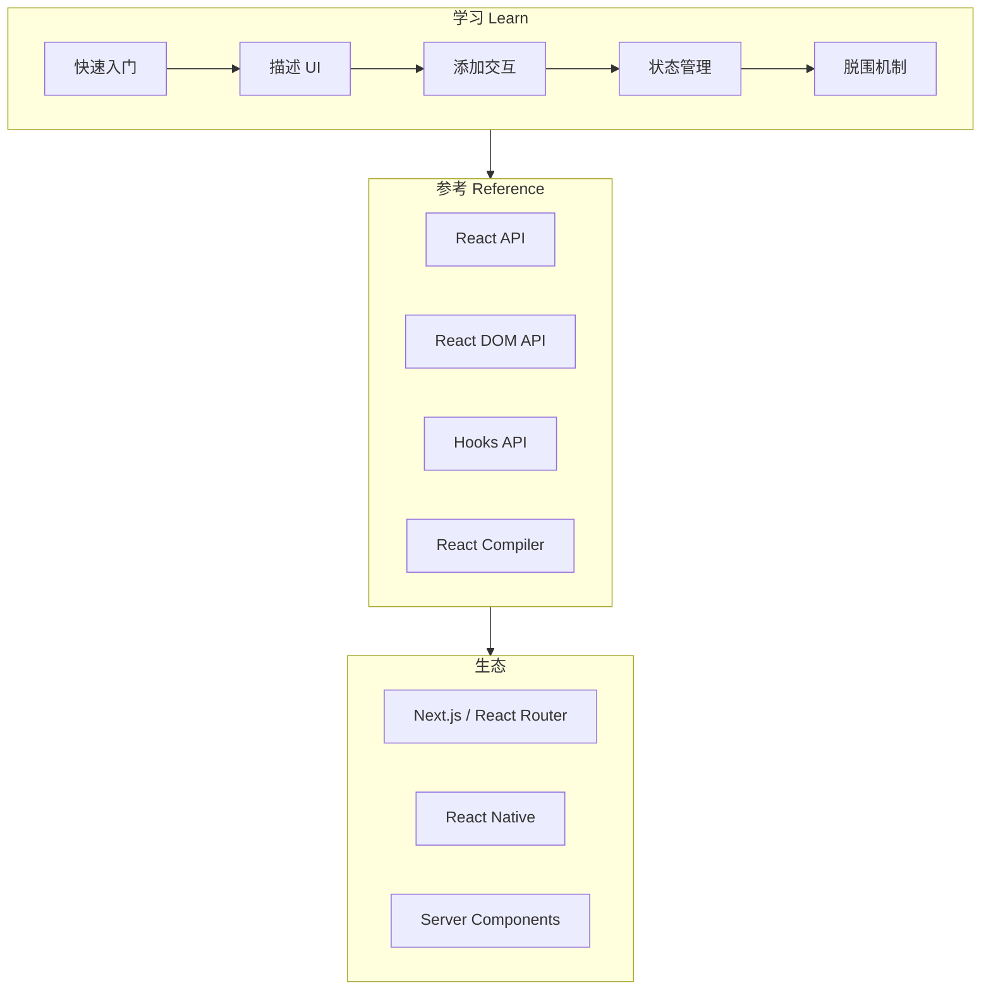

# React 官方文档总结

> 文档来源：[React 官方中文文档](https://zh-hans.react.dev/)（当前版本 v19.x）  
> 本文档系统梳理官方「学习」与「参考」两大板块的核心内容，并归纳最佳实践。

---

## 目录

1. [React 是什么](#1-react-是什么)
2. [安装与项目形态](#2-安装与项目形态)
3. [描述 UI：组件与 JSX](#3-描述-ui组件与-jsx)
4. [添加交互：State 与事件](#4-添加交互state-与事件)
5. [状态管理](#5-状态管理)
6. [渲染模型：触发、渲染与提交](#6-渲染模型触发渲染与提交)
7. [脱围机制：Ref、Effect 与外部系统](#7-脱围机制refeffect-与外部系统)
8. [Hooks 体系](#8-hooks-体系)
9. [性能优化与 React Compiler](#9-性能优化与-react-compiler)
10. [全栈框架与 Server Components](#10-全栈框架与-server-components)
11. [React Native 与跨平台](#11-react-native-与跨平台)
12. [API 参考速览](#12-api-参考速览)
13. [最佳实践总汇](#13-最佳实践总汇)

---

## 1. React 是什么

React 是用于构建 **Web** 与 **原生** 交互界面的 JavaScript 库，由 Meta 维护，现由 [React Foundation](https://zh-hans.react.dev/blog)（Linux Foundation 旗下）托管。

### 1.1 核心定位

| 维度 | 说明 |
|------|------|
| **库，非框架** | 负责 UI 组合，不内置路由、数据获取；全栈应用需配合 Next.js、React Router 等 |
| **组件化** | UI 拆为可复用组件，用 JavaScript 函数 + JSX 描述 |
| **声明式** | 描述「给定状态下 UI 应是什么样」，由 React 负责更新 DOM |
| **渐进式** | 可嵌入现有 HTML 页面，也可从零搭建完整 SPA |

### 1.2 三大能力支柱

1. **组件组合**：`Thumbnail`、`LikeButton`、`Video` 等独立组件组合成应用。
2. **响应式更新**：用户交互 → 更新 state → React 重渲染 → 屏幕与数据一致。
3. **架构扩展**：配合框架实现 SSR、流式 HTML、Server Components、React Native 等。

### 1.3 React 哲学（官方核心原则）

- **UI = f(state)**：界面是状态的函数，不直接命令式改 DOM。
- **单向数据流**：数据向下（props），事件向上（回调）。
- **纯渲染**：组件渲染应是纯函数——相同输入，相同输出。
- **组合优于继承**：用 `children`、render props、自定义 Hook 复用逻辑。

---

## 2. 安装与项目形态

官方文档：[安装](https://zh-hans.react.dev/learn/installation)

### 2.1 四种使用方式

| 方式 | 适用场景 |
|------|----------|
| **在线 Sandbox** | 快速体验（CodeSandbox、StackBlitz、文档内嵌编辑器） |
| **推荐框架新建** | 生产级全栈应用（Next.js、React Router 等） |
| **从零配置** | 学习构建工具链或特殊需求 |
| **嵌入已有页面** | 在静态 HTML 中局部挂载 React 组件 |

### 2.2 重要变更

- **Create React App (CRA) 已不建议使用**，官方推荐迁移到现代框架。
- 客户端入口典型写法：

```javascript
import { createRoot } from 'react-dom/client';

const root = createRoot(document.getElementById('root'));
root.render(<App />);
```

### 2.3 学习路径（官方推荐顺序）

1. [快速入门](https://zh-hans.react.dev/learn) — 日常 80% 概念  
2. [描述 UI](https://zh-hans.react.dev/learn/describing-the-ui)  
3. [添加交互](https://zh-hans.react.dev/learn/adding-interactivity)  
4. [状态管理](https://zh-hans.react.dev/learn/managing-state)  
5. [脱围机制](https://zh-hans.react.dev/learn/escape-hatches)  
6. [API 参考](https://zh-hans.react.dev/reference/react)

---

## 3. 描述 UI：组件与 JSX

### 3.1 组件

- React 组件是 **返回 JSX 的 JavaScript 函数**。
- 组件名必须 **大写开头**（`MyButton`），HTML 标签小写（`button`）。
- 使用 `export default` 导出文件主组件。
- 组件可嵌套组合，形成组件树。

```javascript
function MyButton() {
  return <button>我是一个按钮</button>;
}

export default function MyApp() {
  return (
    <div>
      <h1>欢迎来到我的应用</h1>
      <MyButton />
    </div>
  );
}
```

### 3.2 JSX

- JSX 是 JavaScript 语法扩展，将标签与逻辑放在一起。
- 比 HTML 更严格：标签必须闭合；组件只能返回 **一个根**（可用 `<>...</>` Fragment）。
- **大括号 `{}`**：在 JSX 中嵌入 JavaScript 表达式。
- 属性：`className`（非 `class`）、`style={{ width: 90 }}`（内联对象）。
- 条件与列表 **无特殊语法**，直接用 JavaScript（`if`、`? :`、`&&`、`map`）。

### 3.3 Props

- Props 是父组件传给子组件的 **只读** 数据。
- 解构：`function MyButton({ count, onClick }) { ... }`
- Props 不可在子组件内修改；需要变更时由父组件通过回调更新 state。

### 3.4 条件渲染

```javascript
// if 语句
let content = isLoggedIn ? <AdminPanel /> : <LoginForm />;

// 三元运算符（JSX 内）
{isLoggedIn ? <AdminPanel /> : <LoginForm />}

// 逻辑与（无 else）
{isLoggedIn && <AdminPanel />}
```

### 3.5 列表渲染与 key

```javascript
const listItems = products.map(product =>
  <li key={product.id}>{product.title}</li>
);
```

- **`key` 必须稳定、唯一**，通常来自数据 ID。
- **禁止**：用随机数或数组下标作为会重排的列表的 key。
- key 帮助 React 在插入、删除、重排时正确复用 DOM。

### 3.6 样式

- 使用 `className` + 独立 CSS 文件（或 CSS Modules、CSS-in-JS，React 不强制）。
- 动态样式可用 `style` 对象。

---

## 4. 添加交互：State 与事件

### 4.1 为什么需要 State

普通变量在重渲染后会重置，且修改它们 **不会触发重渲染**。State 同时解决：

1. **跨渲染保留数据**
2. **变更时触发重新渲染**

### 4.2 useState

```javascript
import { useState } from 'react';

function MyButton() {
  const [count, setCount] = useState(0);

  function handleClick() {
    setCount(count + 1);
  }

  return <button onClick={handleClick}>点了 {count} 次</button>;
}
```

- 返回 `[state, setState]`，命名惯例 `[something, setSomething]`。
- **每个组件实例拥有独立 state**（同一组件渲染两次 = 两份 state）。
- 初始值：`useState(0)` 或惰性初始化 `useState(() => computeInitial())`。

### 4.3 事件处理

```javascript
<button onClick={handleClick}>点我</button>  // ✅ 传函数引用
<button onClick={handleClick()}>点我</button> // ❌ 立即调用
```

- 事件对象为 React 合成事件（`SyntheticEvent`），行为与 DOM 类似。
- 需要阻止默认行为时调用 `e.preventDefault()`。

### 4.4 Hook 规则

1. **只在组件或自定义 Hook 顶层调用**，不在循环、条件、嵌套函数中调用。
2. 以 `use` 开头的函数为 Hook（`useState`、`useEffect`、`useRef` 等）。
3. 条件使用 state 时，应 **提取子组件** 在子组件内调用 Hook。

### 4.5 状态提升（Lifting State Up）

多个子组件需共享同一数据时：

1. 将 state 上移到 **最近共同父组件**
2. 父组件通过 **props 下发** state 与 **setter/回调**
3. 子组件通过回调通知父组件更新

数据流：**向下 props，向上事件**。

---

## 5. 状态管理

官方章节：[状态管理](https://zh-hans.react.dev/learn/managing-state)

### 5.1 用 State 响应输入（状态驱动 UI）

不要写「禁用按钮、显示成功」等命令式步骤，而是：

1. 定义 UI 的多种 **状态**（typing、submitting、success）
2. 用 state 变量表示当前状态
3. 根据状态 **声明式渲染** UI
4. 用户操作 → 更新 state → UI 自动变化

```javascript
const [status, setStatus] = useState('typing');

if (status === 'success') {
  return <h1>答对了！</h1>;
}

// 根据 status 控制 disabled、错误信息等
```

### 5.2 选择 State 结构（五条原则）

| 原则 | 说明 |
|------|------|
| **合并关联 state** | 多个变量总是一起更新 → 合并为一个对象 |
| **避免矛盾 state** | 不要 `isSending` 和 `isSent` 同时为 true |
| **避免冗余 state** | 能从 props/state 算出的不要存（如 `fullName`） |
| **避免重复 state** | 同一数据不要在多处复制 |
| **避免深层嵌套** | 扁平化；更新时用展开运算符 `{ ...obj, field: value }` |

**反例**：`fullName` 由 `firstName + lastName` 算出却单独存 state。  
**正例**：`const fullName = firstName + ' ' + lastName;`

### 5.3 状态提升 vs Context vs 外部库

| 方案 | 适用 |
|------|------|
| **状态提升** | 兄弟/近亲组件共享 |
| **Context** | 跨多层传递「全局」配置（主题、语言、当前用户） |
| **Redux / Zustand 等** | 复杂全局状态、中间件、时间旅行调试 |

### 5.4 Context 避免 Prop Drilling

```javascript
const ThemeContext = createContext(null);

export default function MyApp() {
  const [theme, setTheme] = useState('light');
  return (
    <ThemeContext.Provider value={theme}>
      <Page />
    </ThemeContext.Provider>
  );
}

function Button() {
  const theme = useContext(ThemeContext);
  return <button className={theme} />;
}
```

- Provider 包裹的子树均可 `useContext` 读取。
- Context 值变化会导致 **所有消费该 Context 的组件重渲染** → 可拆分多个 Context 或配合 `useMemo` 优化 value。

### 5.5 useReducer 整合复杂逻辑

```javascript
const [state, dispatch] = useReducer(reducer, initialState);

function reducer(state, action) {
  switch (action.type) {
    case 'incremented_age':
      return { ...state, age: state.age + 1 };
    default:
      throw Error('Unknown action: ' + action.type);
  }
}
```

- 适合多字段、多操作类型的表单、向导、复杂 UI 状态机。
- 与 Context 组合可实现轻量全局状态（`dispatch` + `useReducer`）。

### 5.6 保留与重置 State

React 根据 **组件在树中的位置** 识别组件身份：

- **相同位置、相同类型** → 保留 state。
- **key 变化** → React 视为新组件，**销毁旧 state、重建 DOM**。

```javascript
<Profile userId={userId} key={userId} />
```

用 `key` 在切换用户/路由时重置表单等局部 state，优于在 Effect 里 `setComment('')`。

### 5.7 受控 vs 非受控组件

| 类型 | 特点 |
|------|------|
| **受控** | 表单值由 React state + `value`/`onChange` 驱动，单一数据源 |
| **非受控** | 用 `ref` 读 DOM，适合简单表单或与第三方库集成 |

官方推荐：**优先受控组件**，数据流清晰。

---

## 6. 渲染模型：触发、渲染与提交

官方文档：[渲染与提交](https://zh-hans.react.dev/learn/render-and-commit)

### 6.1 三阶段

```
触发（Trigger） → 渲染（Render） → 提交（Commit） → 浏览器绘制（Paint）
```

| 阶段 | 行为 |
|------|------|
| **触发** | 初次 `createRoot().render()` 或 `setState` |
| **渲染** | 调用组件函数，计算新的 JSX（纯计算，不改 DOM） |
| **提交** | 将变更应用到 DOM（`appendChild` 或最小化更新） |

### 6.2 渲染是纯函数

- 相同 props/state → 相同 JSX。
- 渲染中 **不要** 修改外部变量、props、发起副作用。
- **Strict Mode（开发）** 会双次调用组件函数，用于暴露不纯逻辑。

### 6.3 提交阶段的 DOM 优化

- React 比较前后两次渲染，**仅更新有差异的 DOM 节点**。
- 未变化的 DOM 节点（如 `<input>` 的 focus、未改属性）会保留。

### 6.4 性能提示

- 默认从根向下递归渲染子树；大树顶更新可能较慢。
- **不要过早优化**；出现瓶颈再读 [性能](https://zh-hans.react.dev/learn/render-and-commit#optimizing-performance) 章节。

---

## 7. 脱围机制：Ref、Effect 与外部系统

官方章节：[脱围机制](https://zh-hans.react.dev/learn/escape-hatches)

脱围机制用于连接 React **之外** 的世界；大多数 UI 逻辑应留在 React 数据流内。

### 7.1 useRef：不触发渲染的「记忆」

```javascript
const ref = useRef(0);
ref.current = ref.current + 1; // 不触发重渲染
```

用途：

- 保存 timeout ID、interval ID
- 引用 DOM 节点（`inputRef.current.focus()`）
- 保存上一次的 props（与渲染期比较）

### 7.2 Ref 操作 DOM

```javascript
const inputRef = useRef(null);
<input ref={inputRef} />
// inputRef.current.focus()
```

- 避免用 ref 代替 props 驱动 UI。
- 仅在需要命令式 API（focus、scroll、测量尺寸）时使用。

### 7.3 useEffect：与外部系统同步

```javascript
useEffect(() => {
  const connection = createConnection();
  connection.connect();
  return () => connection.disconnect(); // cleanup
}, [roomId]);
```

- **在渲染之后** 异步执行，不阻塞绘制。
- **依赖数组**：`[]` 仅挂载/卸载；`[a, b]` 在 a、b 变化时重新执行。
- **必须实现 cleanup**（取消订阅、断开连接、清除定时器）。
- 开发环境 Strict Mode 会 **挂载 → 清理 → 再挂载**，用于发现缺失 cleanup 的 bug。

### 7.4 Effect 生命周期 vs 组件生命周期

- 组件：挂载 / 更新 / 卸载。
- Effect：同步开始 → 同步结束（cleanup）；依赖变化则 **先 cleanup 再重新执行**。

### 7.5 你可能不需要 Effect

官方重点文章：[你可能不需要 Effect](https://zh-hans.react.dev/learn/you-might-not-need-an-effect)

| 场景 | 推荐做法 | 避免 |
|------|----------|------|
| 由 props/state 派生数据 | 渲染时直接计算 | `useEffect` + `setState` |
| 昂贵计算 | `useMemo` | Effect 里缓存 |
| 用户点击、提交 | 事件处理函数 | Effect 监听 state 发请求 |
| props 变化重置 state | `key={userId}` | Effect 里 `setX('')` |
| 通知父组件 | 在事件中调用父回调 | Effect 里 `onChange()` |
| 初始数据请求 | 框架 loader / `use` + Suspense | 仅客户端 Effect fetch |

**Effect 的正确定位**：连接 **外部系统**（浏览器 API、非 React 库、网络订阅、分析日志）。

### 7.6 useLayoutEffect

- 在 DOM 更新后、**浏览器绘制前** 同步执行。
- 用于测量布局、同步更新 DOM 避免闪烁。
- 能不用就不用，阻塞绘制。

### 7.7 自定义 Hook

- 以 `use` 开头的函数，内部可调用其他 Hook。
- 用于 **复用状态逻辑**（非复用 UI）。
- 每个组件调用自定义 Hook 时拥有 **独立 state**。

```javascript
function useOnlineStatus() {
  const [isOnline, setIsOnline] = useState(true);
  useEffect(() => {
    // 订阅 online/offline
    return () => { /* 取消订阅 */ };
  }, []);
  return isOnline;
}
```

### 7.8 useImperativeHandle

- 与 `forwardRef` 配合，向父组件暴露 **有限命令式 API**（如 `focus()`、`scrollIntoView()`）。
- 默认应优先声明式 props；仅在封装原生控件或第三方组件时使用。

---

## 8. Hooks 体系

### 8.1 内置 Hook 分类

| 类别 | Hook |
|------|------|
| **State** | `useState`, `useReducer` |
| **Context** | `useContext` |
| **Ref** | `useRef`, `useImperativeHandle` |
| **Effect** | `useEffect`, `useLayoutEffect`, `useInsertionEffect` |
| **性能** | `useMemo`, `useCallback` |
| **Transition** | `useTransition`, `useDeferredValue` |
| **外部 store** | `useSyncExternalStore` |
| **标识** | `useId` |
| **React 19+** | `use`, `useActionState`, `useOptimistic`, `useFormStatus` 等 |

### 8.2 useMemo 与 useCallback

```javascript
const visibleTodos = useMemo(
  () => getFilteredTodos(todos, filter),
  [todos, filter]
);

const handleSubmit = useCallback(() => {
  doSomething(a, b);
}, [a, b]);
```

- 用于跳过 **昂贵计算** 或稳定 **子组件 props 引用**（配合 `memo`）。
- 依赖必须完整；过度使用增加复杂度。
- **React Compiler** 可自动记忆化，减少手写。

### 8.3 useTransition 与 useDeferredValue

- **useTransition**：标记低优先级更新（如 Tab 切换、大列表筛选），保持 UI 响应。
- **useDeferredValue**：延迟使用某个值的更新，常用于延迟渲染昂贵子树。

### 8.4 use（React 19）

- 在渲染中读取 **Promise** 或 **Context**（可在条件分支中使用，突破 Hook 规则限制的场景由编译器/约定约束）。
- 需配合 `<Suspense>` 处理加载态。

### 8.5 useActionState / useFormStatus

- 简化表单提交与 pending 状态（替代部分 `useState` + 手动 loading 逻辑）。
- 与 Server Actions 配合用于全栈表单。

---

## 9. 性能优化与 React Compiler

### 9.1 优化层次

1. **正确性优先**：纯组件、合理 state 结构、减少不必要 Effect。
2. **架构**：状态下沉、列表虚拟化、代码分割（`lazy` + `Suspense`）。
3. **记忆化**：`memo`、`useMemo`、`useCallback` 或 Compiler 自动处理。
4. **并发特性**：`startTransition`、`useDeferredValue`。

### 9.2 React.memo

```javascript
const List = memo(function List({ items }) {
  // ...
});
```

- props 浅比较相等则跳过渲染。
- 需配合稳定回调（`useCallback`）才有效。

### 9.3 代码分割

```javascript
const Markdown = lazy(() => import('./Markdown.js'));

<Suspense fallback={<Loading />}>
  <Markdown />
</Suspense>
```

### 9.4 Profiler API

- 测量组件渲染耗时，定位性能瓶颈。

### 9.5 React Compiler

官方：[React Compiler](https://zh-hans.react.dev/learn/react-compiler)

- **编译期自动记忆化**，减少手写 `useMemo` / `useCallback` / `memo`。
- 支持渐进式接入现有项目。
- 需遵循 [规则](https://zh-hans.react.dev/reference/react-compiler)：组件与 Hook 符合可分析的数据流。

---

## 10. 全栈框架与 Server Components

### 10.1 为什么需要框架

React 只管 UI；**路由、数据获取、SSR、构建** 由 Next.js、React Router 等提供。

### 10.2 Server Components（RSC）

- **在服务端运行**，可将数据库、文件系统数据直接传给客户端组件。
- 减少客户端 bundle，支持流式 HTML（`Suspense` + 异步组件）。
- 客户端组件需 `'use client'` 边界。
- 与 **Server Actions** 配合处理表单与变更。

```javascript
// 服务端组件示例（框架内）
async function ConferencePage({ slug }) {
  const conf = await db.Confs.find({ slug });
  return (
    <ConferenceLayout conf={conf}>
      <Suspense fallback={<TalksLoading />}>
        <Talks confId={conf.id} />
      </Suspense>
    </ConferenceLayout>
  );
}
```

### 10.3 Suspense

- 声明式加载边界：子树 suspend 时显示 `fallback`。
- 用于懒加载、数据获取、流式 SSR。

### 10.4 安全提示（官方博客）

- 关注 RSC 相关安全公告，及时升级 React 与框架版本。

---

## 11. React Native 与跨平台

- **React Native**：用 React 编写 **真正原生** UI（非 WebView）。
- **Expo**：简化 RN 开发与发布。
- 同一套组件思维，平台差异通过 `Platform` API 处理。
- Web 与 Native 可共享业务逻辑（Hooks、状态管理），UI 层分平台实现。

---

## 12. API 参考速览

### 12.1 React API

| API | 用途 |
|-----|------|
| `createContext` | 创建 Context |
| `lazy` | 动态 import 组件 |
| `memo` | 记忆化组件 |
| `forwardRef` | 转发 ref |
| `startTransition` | 低优先级更新 |
| `use` | 读 Promise/Context |
| `cache` | 服务端请求去重（框架环境） |

### 12.2 React DOM API

| API | 用途 |
|-----|------|
| `createRoot` | React 18+ 客户端根 |
| `hydrateRoot` | 注水 SSR 内容 |
| `flushSync` | 强制同步刷新（慎用） |

### 12.3 组件

| 组件 | 用途 |
|------|------|
| `<Fragment>` / `<>...</>` | 无 DOM 包裹 |
| `<Suspense>` | 加载边界 |
| `<StrictMode>` | 开发期双重检查 |
| `<Profiler>` | 性能分析 |

---

## 13. 最佳实践总汇

以下归纳自官方「学习」路径与「规则」文档，便于日常开发与 Code Review。

### 13.1 组件与 JSX

- ✅ 小组件、单一职责；命名清晰（`SearchableVideoList`）。
- ✅ 列表项使用稳定 `key`（数据库 ID）。
- ✅ 用 Fragment 避免无意义 DOM 嵌套。
- ❌ 不要在渲染中创建新函数/对象并直接传给已 `memo` 的子组件（除非用 Compiler 或 `useCallback`）。

### 13.2 State

- ✅ **最少 state**：能算的不存，能提升的不散落。
- ✅ 用 **状态机思维**（`status: 'idle' | 'loading' | 'error'`）代替多个布尔 flag。
- ✅ 表单优先 **受控组件**。
- ✅ 切换实体（用户、路由）用 **`key` 重置** 局部 state。
- ❌ 不要在 Effect 里根据 props 同步另一份 state（派生值放渲染期计算）。

### 13.3 数据流

- ✅ 单向数据流；共享 state **提升到最近公共父级**。
- ✅ Context 传 **读多写少** 的全局配置；大对象 value 用 `useMemo` 稳定引用。
- ✅ 复杂更新用 `useReducer` + 明确 `action.type`。
- ❌ 避免深层 prop drilling（超过 2～3 层考虑 Context 或组合）。

### 13.4 Effect 与副作用

- ✅ Effect 只用于 **同步外部系统**；写好 cleanup。
- ✅ 依赖数组完整；用 ESLint `exhaustive-deps`。
- ✅ 用户操作（购买、提交）放在 **事件处理函数**。
- ✅ 数据请求优先框架 **loader / Server Component / `use` + Suspense**。
- ❌ 不要用 Effect 响应「自己的 state 变化」去 set 另一 state（级联渲染）。

### 13.5 性能

- ✅ 先测量（`console.time`、Profiler），再 `useMemo`。
- ✅ 大列表：虚拟化；搜索：debounce 或 `useDeferredValue`。
- ✅ 路由/Tab 切换用 `useTransition` 保持输入流畅。
- ❌ 不要过早优化；不要到处包 `memo` 却无稳定 props。

### 13.6 可访问性与表单

- ✅ 表单控件关联 `<label>`；按钮有可读文本。
- ✅ 使用语义化 HTML；需要时用 ARIA 补充。
- ✅ 错误信息靠近字段，不仅依赖颜色。

### 13.7 项目与工程

- ✅ 新项目用 **官方推荐框架**，不用 CRA。
- ✅ 启用 **TypeScript** 与 Strict Mode（开发）。
- ✅ 关注 React 博客安全与版本说明。
- ✅ 考虑启用 **React Compiler** 减少手动记忆化。

### 13.8 思维检查清单（官方「你可能不需要 Effect」）

在写 `useEffect` 前自问：

1. 是否在做 **用户事件** 该做的事？→ 移到 `onClick` / `onSubmit`。
2. 是否根据 props/state **计算** 另一值？→ 渲染期计算或 `useMemo`。
3. 是否为了 **重置 state**？→ 用 `key`。
4. 是否通知 **父组件**？→ 在事件中调用 props 回调。
5. 是否 **拉取数据**？→ 框架数据层或 `use` + Suspense。
6. 是否连接 **浏览器/第三方/订阅**？→ 这才是 Effect 的用武之地。

### 13.9 与本地笔记的关系

本仓库 [`doc/react.md`](./react.md) 含更多实战片段（状态提升示例、受控/非受控对比等）。本文档对齐 **官方文档体系**；细节以 [zh-hans.react.dev](https://zh-hans.react.dev/) 为准。

---

## 附录：官方文档结构图



---

## 参考链接

| 主题 | 链接 |
|------|------|
| 首页 | https://zh-hans.react.dev/ |
| 快速入门 | https://zh-hans.react.dev/learn |
| 状态管理 | https://zh-hans.react.dev/learn/managing-state |
| 脱围机制 | https://zh-hans.react.dev/learn/escape-hatches |
| 你可能不需要 Effect | https://zh-hans.react.dev/learn/you-might-not-need-an-effect |
| 渲染与提交 | https://zh-hans.react.dev/learn/render-and-commit |
| React Compiler | https://zh-hans.react.dev/learn/react-compiler |
| API 参考 | https://zh-hans.react.dev/reference/react |
| 安装 | https://zh-hans.react.dev/learn/installation |

---

*文档整理自 React 官方中文站 v19.x 学习内容，随官方更新请定期对照官网修订。*
